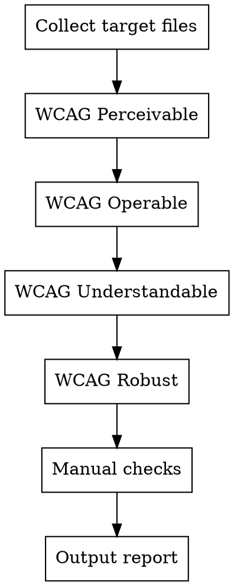

# Accessibility (a11y) Check

Systematic accessibility audit based on WCAG 2.1 AA standards. Organized by the four WCAG principles: Perceivable, Operable, Understandable, Robust.

## When to Use

- After writing HTML/JSX/TSX/Vue template code
- When user runs `/a11y-check`
- Before shipping any user-facing UI
- When accessibility compliance is required
- During PR reviews that touch interactive elements or content

## When NOT to Use

- Backend-only code (no rendered HTML)
- Config files, scripts, or tooling changes
- Style-only changes with no structural impact

## Audit Workflow



1. **Collect target files** — `.tsx/.vue/.svelte/.html` files in scope
2. **Run each WCAG principle** — Check every rule below
3. **Flag manual checks** — Items that require human/browser verification
4. **Output report** — Severity + WCAG criterion number

## WCAG Principle 1: Perceivable

Information and UI components must be presentable to users in ways they can perceive.

### 1.1 Text Alternatives (CRITICAL)

| WCAG | Rule | Do | Don't | Detect |
|------|------|----|-------|--------|
| 1.1.1 | Alt text for images | `` | `` or `` for content images | Search `` or `aria-hidden="true"` | Alt text on purely decorative images | Check decorative images for empty alt |
| 1.1.1 | Icon button labels | `<button aria-label="Close"><XIcon /></button>` | `<button><XIcon /></button>` | Search icon-only buttons for `aria-label` |
| 1.1.1 | Decorative icons hidden | `<Icon aria-hidden="true" />` | Icon announced as "image" by screen reader | Check decorative `<svg>`/`<Icon>` for `aria-hidden` |

### 1.3 Adaptable (HIGH)

| WCAG | Rule | Do | Don't | Detect |
|------|------|----|-------|--------|
| 1.3.1 | Semantic HTML | `<nav>`, `<main>`, `<article>`, `<button>` | `<div>` for everything | Search for `<div onClick` or `<div role="button"` |
| 1.3.1 | Heading hierarchy | Sequential `h1 > h2 > h3` | Skip levels (`h1` then `h4`) | Check heading tag sequence per page |
| 1.3.1 | Form labels | `<label for="email">Email</label><input id="email">` | `<input placeholder="Email">` only | Search inputs without associated `<label>` |
| 1.3.5 | Input purpose | `autocomplete="email"` on email inputs | Missing autocomplete attributes | Check inputs for `autocomplete` attribute |

### 1.4 Distinguishable (CRITICAL)

| WCAG | Rule | Do | Don't | Detect |
|------|------|----|-------|--------|
| 1.4.1 | Not color alone | Red text + error icon for errors | Red border only (color-only indicator) | Check error/success states for non-color indicators |
| 1.4.3 | Contrast (normal text) | Min 4.5:1 ratio — `text-gray-900` on white | `text-gray-400` on `gray-100` (~2.8:1) | Check text/background color pairs |
| 1.4.3 | Contrast (large text) | Min 3:1 ratio for 18px+ or 14px+ bold | Low contrast headings | Check heading color contrast |
| 1.4.4 | Text resize | Text scales with `rem`/`em` | Fixed `px` font sizes | Search for `font-size: *px` in CSS |
| 1.4.10 | Reflow | Content reflows at 320px width | Horizontal scrollbar at 320px | Check for fixed widths > 320px |
| 1.4.11 | Non-text contrast | 3:1 for UI components and borders | Low-contrast borders/icons | Check interactive element border contrast |
| 1.4.12 | Text spacing | Content works with increased spacing | Fixed height with text overflow | Check for `overflow: hidden` on text containers |
| 1.4.13 | Content on hover | Hoverable tooltips dismissible with Esc | Tooltip disappears when moving to it | Check tooltip/popover implementation |

## WCAG Principle 2: Operable

UI components and navigation must be operable.

### 2.1 Keyboard Accessible (CRITICAL)

| WCAG | Rule | Do | Don't | Detect |
|------|------|----|-------|--------|
| 2.1.1 | Keyboard operable | `onKeyDown` alongside `onClick` on custom elements | Click-only `<div>` interactions | Search `<div onClick` without `onKeyDown` |
| 2.1.1 | Tab to all interactive | All buttons/links/inputs reachable via Tab | Unreachable interactive elements | Check custom interactive elements for `tabIndex` |
| 2.1.2 | No keyboard trap | Modal has close button + Esc to dismiss | Focus trapped forever in modal | Check modal/dialog for Esc handler |
| 2.1.4 | Character shortcuts | Single-key shortcuts can be turned off | Undiscoverable single-key shortcuts | Check for single `keydown` listeners |

### 2.4 Navigable (HIGH)

| WCAG | Rule | Do | Don't | Detect |
|------|------|----|-------|--------|
| 2.4.1 | Skip link | `<a href="#main" class="sr-only focus:not-sr-only">Skip to content</a>` | No skip link on nav-heavy pages | Check for skip link as first focusable element |
| 2.4.3 | Focus order | Tab order matches visual order | Confusing tab sequence | Check `tabIndex` values (avoid positive values) |
| 2.4.4 | Link purpose | Descriptive link text | "Click here" or "Read more" alone | Search for generic link text |
| 2.4.6 | Headings describe | Headings describe section content | Vague headings like "Info" or "Details" | Review heading text content |
| 2.4.7 | Focus visible | `focus-visible:ring-2 focus-visible:ring-blue-500` | `outline-none` without ring replacement | Search `outline-none` without `ring` or `focus-visible` |
| 2.4.11 | Focus not obscured | Focused element not hidden by sticky header/footer | Fixed elements covering focused item | Check fixed elements vs focus targets |

### 2.5 Input Modalities (HIGH)

| WCAG | Rule | Do | Don't | Detect |
|------|------|----|-------|--------|
| 2.5.1 | Pointer gestures | Single-click alternatives for complex gestures | Drag-only with no alternative | Check drag/swipe for click alternatives |
| 2.5.3 | Label in name | Visible label matches accessible name | `aria-label` different from visible text | Compare visible text vs `aria-label` |
| 2.5.5 | Target size | Min 44x44px touch targets | Tiny interactive areas (`w-4 h-4` buttons) | Check interactive element dimensions |
| 2.5.8 | Target spacing | Min 8px gap between targets | `gap-0` between adjacent buttons | Check gap between interactive elements |

## WCAG Principle 3: Understandable

Information and UI operation must be understandable.

### 3.1 Readable (MEDIUM)

| WCAG | Rule | Do | Don't | Detect |
|------|------|----|-------|--------|
| 3.1.1 | Page language | `<html lang="ko">` or appropriate lang | Missing `lang` attribute | Check `<html>` for `lang` attribute |
| 3.1.2 | Part language | `<span lang="en">Hello</span>` for mixed content | No lang on foreign text | Check for mixed-language content |

### 3.2 Predictable (HIGH)

| WCAG | Rule | Do | Don't | Detect |
|------|------|----|-------|--------|
| 3.2.1 | No focus change | Focus doesn't trigger unexpected navigation | `onFocus` causes page change | Search for navigation in `onFocus` handlers |
| 3.2.2 | No input change | Input doesn't cause unexpected context change | Select triggers form submit | Check `onChange` for unexpected side effects |
| 3.2.6 | Consistent help | Help link in same location across pages | Help location changes per page | Check help/support link consistency |

### 3.3 Input Assistance (HIGH)

| WCAG | Rule | Do | Don't | Detect |
|------|------|----|-------|--------|
| 3.3.1 | Error identification | `<span role="alert" class="text-red-500">{error}</span>` | Visual-only error (red border only) | Check error messages for `role="alert"` or `aria-live` |
| 3.3.2 | Labels or instructions | Clear labels + helper text for complex inputs | Input without guidance | Check complex inputs for helper text |
| 3.3.3 | Error suggestion | Suggest correction ("Did you mean @gmail.com?") | Just "Invalid input" | Check error message helpfulness |
| 3.3.4 | Error prevention | Confirm before destructive actions | Delete without confirmation | Check delete/destructive handlers |
| 3.3.8 | Accessible auth | Don't rely on cognitive tests | CAPTCHA without alternative | Check authentication flow |

## WCAG Principle 4: Robust

Content must be robust enough for assistive technologies.

### 4.1 Compatible (HIGH)

| WCAG | Rule | Do | Don't | Detect |
|------|------|----|-------|--------|
| 4.1.2 | Name, role, value | ARIA attributes on custom widgets | Custom widget without ARIA | Check custom controls for `role`, `aria-*` |
| 4.1.2 | aria-live regions | `<div aria-live="polite">{status}</div>` | Silent async updates | Check dynamic content for `aria-live` |
| 4.1.3 | Status messages | `role="status"` for non-intrusive updates | Status changes not announced | Check toast/status for `role="status"` |

## Anti-Patterns (CRITICAL — Immediate Fix)

These are never acceptable:

| Anti-Pattern | Why | Fix |
|--------------|-----|-----|
| `outline-none` without replacement | Keyboard users can't see focus | Add `focus-visible:ring-2` |
| `maximum-scale=1` in viewport | Blocks user zoom | Remove `maximum-scale` and `user-scalable=no` |
| `onPaste={e => e.preventDefault()}` | Blocks password managers | Remove paste prevention |
| `<div onClick>` without keyboard | Keyboard users excluded | Use `<button>` or add `onKeyDown` + `tabIndex={0}` |
| `tabIndex > 0` | Breaks natural tab order | Use `tabIndex={0}` or `tabIndex={-1}` only |

## Manual Check List

Items that cannot be fully verified by code review alone. Flag these for human testing:

- [ ] Screen reader announces content in logical order
- [ ] Tab order matches visual layout
- [ ] All modal/dialog focus traps work correctly (trap + Esc release)
- [ ] Color contrast passes in both light and dark modes
- [ ] Content is usable at 200% zoom
- [ ] All animations respect `prefers-reduced-motion`
- [ ] Touch targets are comfortable on actual mobile devices
- [ ] Error messages are announced by screen reader (`aria-live`)

## Report Format

```markdown
## Accessibility Audit Report — {file/component}

### CRITICAL (WCAG A — must fix)
1. [WCAG {number}] {Issue} — {file}:{line}
   Problem: {description}
   Fix: {recommended solution}

### HIGH (WCAG AA — should fix)
...

### MEDIUM (Best practice)
...

### NEEDS MANUAL CHECK
- [ ] {Item requiring browser/device testing}

### Summary
- WCAG Level A violations: {count}
- WCAG Level AA violations: {count}
- Best practice issues: {count}
- Manual checks needed: {count}
```

## Severity Mapping

| Severity | WCAG Level | Examples |
|----------|-----------|---------|
| **CRITICAL** | A (must fix) | Missing alt text, no keyboard access, no focus visible, zoom disabled |
| **HIGH** | AA (should fix) | Contrast <4.5:1, missing skip link, poor heading hierarchy, no error announcements |
| **MEDIUM** | Best practice | Missing `lang`, inconsistent help location, poor error suggestions |
