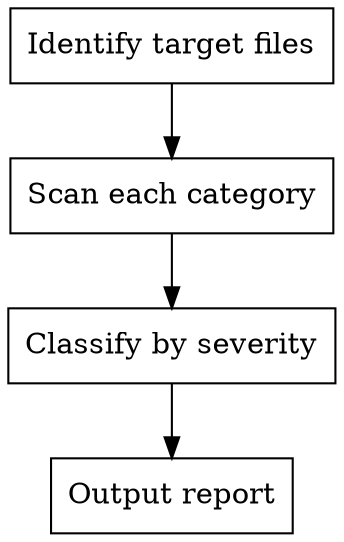

# UI/UX Code Review

Systematic review of frontend code for UI/UX quality issues. Scans for visual, interaction, layout, animation, responsive, typography, and form problems.

## When to Use

- After writing or modifying UI components (`.tsx`, `.vue`, `.svelte`, `.html`)
- During PR reviews that touch frontend code
- When user runs `/ui-review`
- Before delivering any UI to production

## When NOT to Use

- Backend-only code changes
- Pure logic/utility changes with no UI
- Design system generation (use `ui-ux-pro-max` instead)

## Review Workflow



1. **Identify target files** — Collect changed `.tsx/.vue/.svelte/.html/.css` files
2. **Scan each category** — Check every rule below against the code
3. **Classify by severity** — HIGH issues first, then MEDIUM, then LOW
4. **Output report** — Use the report format at the bottom

## Review Categories

### 1. Icons & Visual Elements (HIGH)

| Rule | Do | Don't | Detect |
|------|----|-------|--------|
| No emoji icons | SVG icons (Heroicons, Lucide, Simple Icons) | Emojis as UI icons (🎨 🚀 ⚙️) | Search for emoji Unicode in JSX/HTML |
| Consistent icon set | Same library throughout (e.g., all Lucide) | Mix Heroicons + FontAwesome + custom | Check import sources |
| Correct brand logos | Verify from Simple Icons or official source | Guess SVG paths | Check logo `<svg>` or `` sources |
| Consistent icon sizing | Fixed viewBox (24x24) with `w-6 h-6` | Random sizes | Check icon `className` or `style` |
| Stable hover states | Color/opacity transitions on hover | `scale` transforms that shift layout | Search `hover:scale` |

### 2. Interaction & Cursor (HIGH)

| Rule | Do | Don't | Detect |
|------|----|-------|--------|
| Cursor pointer | `cursor-pointer` on all clickable elements | Default cursor on buttons/cards/links | Check clickable elements for cursor class |
| Hover feedback | Visual change on hover (color, shadow, border) | No indication element is interactive | Search interactive elements without `hover:` |
| Smooth transitions | `transition-colors duration-200` (150-300ms) | Instant changes or `duration-1000` | Check `duration-*` values |
| Specific transitions | `transition-colors` or `transition-opacity` | `transition-all` (performance hit) | Search `transition-all` |
| Loading buttons | Disable + spinner during async | Allow multiple clicks during loading | Check form submit handlers |
| Error feedback | Clear error message near the problem | Silent failures | Check catch blocks for user feedback |
| Confirmation dialogs | Confirm before delete/destructive actions | Direct delete on click | Check delete handlers for confirm |
| Focus states | `focus:ring-2 focus:ring-blue-500` or visible focus | `outline-none` without replacement | Search `outline-none` without `ring` |

### 3. Layout & Spacing (HIGH)

| Rule | Do | Don't | Detect |
|------|----|-------|--------|
| Floating navbar spacing | `top-4 left-4 right-4` if floating | Stick to `top-0 left-0 right-0` | Check fixed navbar positioning |
| Content padding | Account for fixed navbar height (`pt-20`) | Content hidden behind fixed elements | Check main content padding-top |
| Consistent max-width | Same `max-w-6xl` or `max-w-7xl` across pages | Mix different container widths | Compare `max-w-*` across sections |
| Z-index scale | Use system: `z-10 z-20 z-30 z-50` | Arbitrary `z-[9999]` | Search `z-[` for arbitrary values |
| Content jumping | Reserve space for async content (`aspect-ratio`) | No dimensions on images/async content | Check `` for width/height or aspect-ratio |
| Viewport units | `min-h-dvh` or `min-h-screen` | `h-screen` on mobile (100vh issue) | Search `h-screen` in mobile contexts |

### 4. Animation (MEDIUM)

| Rule | Do | Don't | Detect |
|------|----|-------|--------|
| Duration timing | 150-300ms for micro-interactions | >500ms for UI, <100ms (too fast) | Check `duration-*` values |
| Transform performance | `transform` and `opacity` for animations | Animate `width/height/top/left` | Search CSS animations for non-transform props |
| Reduced motion | Check `prefers-reduced-motion` | Ignore motion accessibility | Search for `prefers-reduced-motion` |
| Excessive motion | Max 1-2 animated elements per view | `animate-bounce` on 5+ elements | Count `animate-*` classes per component |
| Loading states | Skeleton screens or spinners | Frozen UI during loading | Check async operations for loading UI |
| Easing functions | `ease-out` for entering, `ease-in` for exiting | `linear` for UI transitions | Check easing values |

### 5. Light/Dark Mode (MEDIUM)

| Rule | Do | Don't | Detect |
|------|----|-------|--------|
| Glass card light mode | `bg-white/80` or higher opacity | `bg-white/10` (too transparent) | Check `bg-white/` opacity values |
| Text contrast (light) | `text-slate-900` (#0F172A) for body | `text-slate-400` for body text | Check body text color classes |
| Muted text (light) | `text-slate-600` minimum for secondary | `text-gray-400` or lighter | Check secondary text color classes |
| Border visibility | `border-gray-200` in light mode | `border-white/10` (invisible) | Check border color with `dark:` variants |
| Both modes tested | Styles for both `dark:` and light | Only one mode styled | Search for missing `dark:` counterparts |

### 6. Responsive Design (HIGH)

| Rule | Do | Don't | Detect |
|------|----|-------|--------|
| Viewport meta | `width=device-width, initial-scale=1` | Missing or `maximum-scale=1` (blocks zoom) | Check `<meta name="viewport">` |
| Readable font size | Min 16px (`text-base`) body on mobile | `text-xs` or `text-sm` for body | Check body text size classes |
| No horizontal scroll | Content fits viewport width | Content wider than viewport | Search for fixed widths without `max-w-full` |
| Touch targets | Min 44x44px interactive elements | Tiny buttons (`w-6 h-6`) | Check interactive element sizes |
| Touch spacing | Min 8px (`gap-2`) between touch targets | `gap-0` or `gap-1` between buttons | Check gap between interactive elements |
| Image scaling | `max-w-full h-auto` on images | Fixed width images | Check `` for responsive classes |
| Mobile-first | Default mobile + `md:` `lg:` `xl:` | Desktop-first with max-width queries | Check breakpoint direction |
| Table handling | `overflow-x-auto` wrapper on tables | Wide tables breaking layout | Check `<table>` containers |

### 7. Typography (MEDIUM)

| Rule | Do | Don't | Detect |
|------|----|-------|--------|
| Line height | `leading-relaxed` (1.625) for body | `leading-none` or `leading-tight` for body | Check body `leading-*` |
| Line length | `max-w-prose` (65-75ch) for paragraphs | Full viewport width text | Check paragraph containers for max-width |
| Heading hierarchy | Sequential `h1 > h2 > h3` | Skip levels (h1 then h4) | Check heading tag order |
| Contrast readability | `text-gray-900` on light backgrounds | `text-gray-400` on `gray-100` | Check text/bg contrast pairs |
| Font size scale | Consistent scale (12, 14, 16, 18, 24, 32) | Random arbitrary font sizes | Check `text-*` class consistency |

### 8. Forms (HIGH)

| Rule | Do | Don't | Detect |
|------|----|-------|--------|
| Visible labels | `<label>` above/beside every input | Placeholder as only label | Check inputs for associated labels |
| Error placement | Error message below related input | Single error at form top | Check error rendering location |
| Input types | `type="email"`, `type="tel"`, `type="url"` | `type="text"` for everything | Check input type attributes |
| Autocomplete | `autocomplete="email"` etc. | Missing autocomplete attributes | Check inputs for autocomplete |
| Required indicators | Asterisk or "(required)" text | No indication of required fields | Check required field markers |
| Submit feedback | Loading + success/error state | No feedback after submit | Check form submit handlers |
| Never block paste | Allow paste on all inputs | `onPaste={e => e.preventDefault()}` | Search for paste prevention |

### 9. Feedback & States (MEDIUM)

| Rule | Do | Don't | Detect |
|------|----|-------|--------|
| Empty states | Helpful message + action ("No items yet. Create one!") | Blank empty screens | Check list/table empty states |
| Error recovery | "Try again" button + help link | Error message only | Check error UI for recovery actions |
| Progress indicators | Step indicators for multi-step flows | No indication of progress | Check multi-step forms for progress UI |
| Toast auto-dismiss | Auto-dismiss after 3-5 seconds | Toasts that never disappear | Check toast/notification duration |

## Report Format

```markdown
## UI/UX Review Report — {component/file name}

### HIGH ({count} issues)
1. [{Category}] {Issue description} — {file}:{line}
   Do: {recommended fix}
   Don't: {current problem}

### MEDIUM ({count} issues)
...

### LOW ({count} issues)
...

### Summary
- Total issues: {count}
- HIGH: {count} | MEDIUM: {count} | LOW: {count}
- Top priority: {most impactful fix}
```

## Quick Severity Guide

| Severity | Meaning | Examples |
|----------|---------|---------|
| **HIGH** | Broken UX or inaccessible | Missing cursor-pointer, no focus states, content behind navbar, no viewport meta |
| **MEDIUM** | Suboptimal but functional | Slow transitions, inconsistent typography, missing empty states |
| **LOW** | Polish and refinement | Toast duration, date formatting, easing functions |
